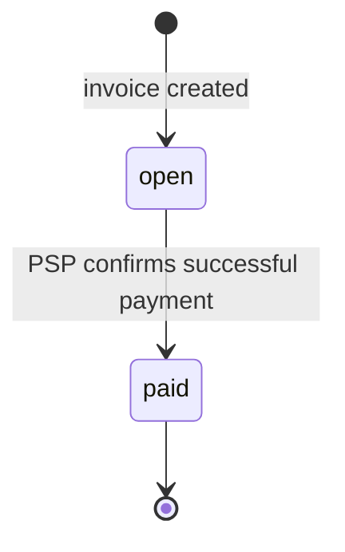

# Invoice & Payment Service Design

## Scope and architecture

This is a small billing backend, not a card processor. A business uses an API
key to create customers and invoices. A customer payment creates a payment
attempt and is sent over HTTP to a separate mock PSP service. PostgreSQL is the
source of truth for the billing service. A database-backed worker delivers
webhooks and reconciles uncertain PSP calls; neither job blocks the API
response.

```text
Client -> Invoice API -> PostgreSQL
                     -> Mock PSP (HTTP)
PostgreSQL outbox -> worker -> registered webhook endpoint
```

The implementation uses Rust with Axum, SQLx migrations, PostgreSQL, and
Docker Compose. The compose environment seeds one development business and
one API key so `docker compose up` requires no manual provisioning.

## 1. Data model

All primary keys are UUIDs generated by the application. Monetary columns are
`BIGINT` cents with non-negative database checks; Rust uses checked integer
multiplication/addition when calculating totals. Currency is always the
literal `USD`.

| Table | Shape and important indexes | Rationale / 100x change |
| --- | --- | --- |
| `businesses` | `id`, `name`, timestamps | Tenant root. At 100x, partition operational tables by business or time, not this table. |
| `api_keys` | `id`, `business_id`, unique `prefix`, `secret_hash`, `created_at`, `revoked_at`; index `(prefix) WHERE revoked_at IS NULL` | Prefix narrows lookup before Argon2id verification; the secret is never stored. At 100x, cache valid prefix metadata briefly. |
| `customers` | `id`, `business_id`, `name`, `email`, timestamps; index `(business_id, created_at DESC)` | Every customer is tenant-scoped. Email is deliberately not globally unique. |
| `invoices` | `id`, `business_id`, `customer_id`, `status`, `currency`, `total_cents`, `due_date`, timestamps; indexes `(business_id, status, created_at DESC)` and `(customer_id)` | Stores the invoice snapshot and makes list-by-state cheap. At 100x, partition by business/time and use a read replica for listing. |
| `invoice_line_items` | `id`, `invoice_id`, `description`, `quantity`, `unit_amount_cents`, `line_total_cents` | Preserves the exact charged line-item snapshot. It is written only during invoice creation. |
| `payment_attempts` | `id`, `invoice_id`, `status`, `card_token`, `psp_ref`, `failure_code`, `recovery_attempts`, timestamps; unique `(invoice_id) WHERE status = 'pending'` | The partial unique index allows exactly one unresolved payment per invoice. At 100x, archive old attempts and index recovery queries by `(status, updated_at)`. |
| `idempotency_keys` | `business_id`, `key`, `request_hash`, `state`, `payment_attempt_id`, `response_status`, `response_body`, timestamps; unique `(business_id, key)` | Stores a completed response for safe replay and detects changed request bodies. TTL cleanup is appropriate at 100x. |
| `webhook_endpoints` | `id`, `business_id`, `url`, encrypted signing secret, `active`, timestamps; index `(business_id, active)` | Each registration gets a random secret shown once. The service needs the secret to sign, so it is encrypted with an app-configured development key; a production deployment would use KMS. |
| `webhook_events` / `webhook_deliveries` | event type/payload and one delivery per endpoint; unique `(event_id, endpoint_id)`; index pending deliveries by `next_attempt_at` | This is the transactional outbox. It makes events durable before background delivery begins. At 100x, move workers to a separate consumer fleet. |

An invoice may only reference a customer belonging to the authenticated
business. Every read and write includes the authenticated `business_id`;
cross-tenant IDs behave as not found.

## 2. Invoice state machine

Invoices start `open`. Two states are enough for the required surface; voids,
collections, and drafts are intentionally not exposed.



`paid` is terminal. There are no reversible transitions. A failed payment,
PSP timeout, or network error leaves the invoice `open`, allowing a later new
payment attempt. `POST /invoices/{id}/pay` on `paid` returns HTTP 409 with
`invoice_not_payable`; there is no API that can write an arbitrary invoice
state. Database updates also condition on `status = 'open'`, so a handler bug
cannot silently transition a paid invoice.

## 3. Payment correctness and failure modes

`POST /invoices/{id}/pay` requires an `Idempotency-Key`. The HTTP method,
invoice path, and canonicalized request body are SHA-256 hashed together. In a
short transaction, the service locks
the invoice with `SELECT ... FOR UPDATE`, creates a `pending` payment attempt
and its idempotency record, then commits before making the HTTP call. The PSP
idempotency reference is the stable payment-attempt UUID.

The short lock prevents concurrent setup races. Once it is released, the
partial unique index prevents a second key from creating another pending
attempt. This is preferable to holding a row lock through a slow network call:
it does not exhaust database connections or make a PSP outage lock invoices.

- **Two simultaneous payment requests:** the first creates the pending
  attempt. A duplicate idempotency key does not call the PSP; it either
  replays the completed response or returns `202 payment_processing` while it
  is still live. A different key returns `409 payment_in_progress`. Therefore
  at most one PSP charge is created.
- **`tok_timeout`:** the API's PSP deadline is two seconds, so the caller gets
  `202` promptly and the invoice remains `open` with a pending attempt. The
  mock PSP records a processing charge under the stable reference and completes
  it at about 30 seconds. A recovery worker polls its status and applies the
  eventual result. The caller can retrieve the invoice/payment attempt or retry
  the same idempotency key.
- **PSP succeeds, then the service crashes before persisting:** recovery asks
  the PSP for the stable reference. The mock PSP returns the prior successful
  result rather than creating a new charge, after which the service marks the
  attempt succeeded and invoice paid. This PSP-level idempotency is essential;
  a database lock alone cannot protect the external side effect.
- **A key is reused with a different body:** the stored hash differs, so the
  service returns HTTP 409 `idempotency_key_reused`; it never repurposes a key.
- **Paying a paid invoice:** return HTTP 409 `invoice_not_payable` without
  creating an attempt or calling the PSP.

On a normal PSP success, one transaction locks the attempt and invoice, marks
the attempt `succeeded`, marks the invoice `paid`, stores the idempotent
response, and inserts an `invoice.paid` outbox event. A card decline marks the
attempt `failed`, leaves the invoice open, stores the response, and inserts
`invoice.payment_failed`. Concurrent recovery and request handlers serialize
on the payment-attempt row; only the first terminal transition wins.

`tok_network_error` produces no charge in this specified mock. The service
returns `202`, retries recovery three times (5, 20, and 60 seconds), and then
marks the attempt `failed` with `psp_unavailable`, leaving the invoice open.
This avoids a permanently pending invoice. In a real PSP, an unknown charge
outcome would require provider reconciliation rather than assuming no charge.

## 4. Webhook design

Businesses can register HTTP(S) endpoint URLs; the local Compose demo may use
HTTP, while a production deployment would require HTTPS and block private
network destinations. Creating an invoice inserts
`invoice.created` into the outbox in the same transaction as the invoice;
payment transactions do the same for paid/failed events. The worker claims
due deliveries with `FOR UPDATE SKIP LOCKED`, so many worker instances can run
without duplicate delivery and the request path never waits for receiver HTTP.

Each delivery body is JSON and has `X-Dodo-Event-Id` and
`X-Dodo-Timestamp` headers. `X-Dodo-Signature` is
`v1=<hex HMAC-SHA256(secret, timestamp + "." + event_id + "." + raw_body)>`.
The receiver rejects timestamps older than five minutes and deduplicates event
IDs, giving it replay protection. Any non-2xx response or network error is a
failure. Deliveries are attempted immediately, then after 1s, 5s, 30s, 2m,
10m, and 30m. After six failures they are marked exhausted, never silently
dropped. `GET /webhook-events` lets a business inspect event and delivery
status to reconcile missed notifications.

## 5. API key model

Keys look like `dodo_<prefix>_<random-secret>`, where the secret has at least
256 bits of randomness. The full key is shown only at generation; PostgreSQL
stores the prefix and Argon2id hash of the secret. Clients transmit it using
`Authorization: Bearer <key>` over HTTPS. Revocation sets `revoked_at` and
immediately rejects the key. Rotation means issuing a new key, deploying it,
then revoking the old key; no key is shared across businesses. A leaked active
key grants that business's API access until revocation, but cannot access a
different business.

## 6. What I deliberately cut

- Real card handling, refunds, partial payments, subscriptions, and tax/FX.
- Arbitrary invoice state editing, drafts, voids, and collections workflows.
- Email delivery and a frontend.
- OAuth, production rate limiting, and a general job queue.
- A production PSP reconciliation integration; the mock's query endpoint is
  only the smallest mechanism needed to model a known timeout outcome.

## 7. Production readiness gap

The first additions for a production launch would be structured telemetry and
alerts (especially payment/webhook lag), a proper audit trail and role model,
and rate limiting plus abuse controls. Refunds, disputes, dunning, KMS-backed
secret management, and real-PSP reconciliation would follow before processing
real money.

## API shape and errors

The minimal API is: customer create/get/list; invoice create/get/list filtered
by `status`; invoice payment; webhook endpoint create/list; webhook event
list. Every error has the shape
`{"error":{"code":"...","message":"...","request_id":"..."}}`.
Validation is HTTP 422, authentication 401, not found 404, invalid business
state/idempotency conflict 409, and an accepted uncertain payment 202.
